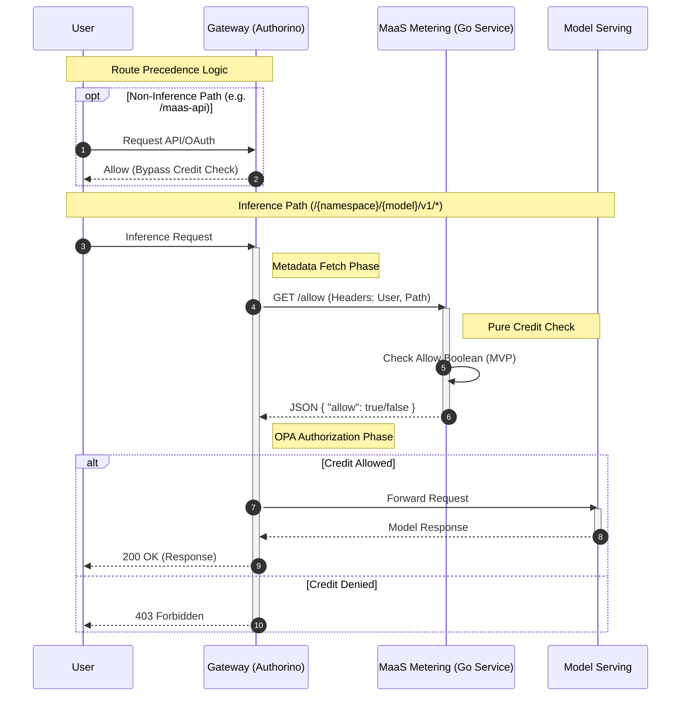
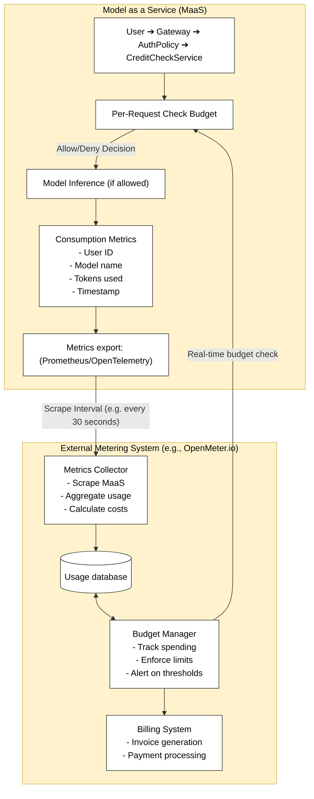
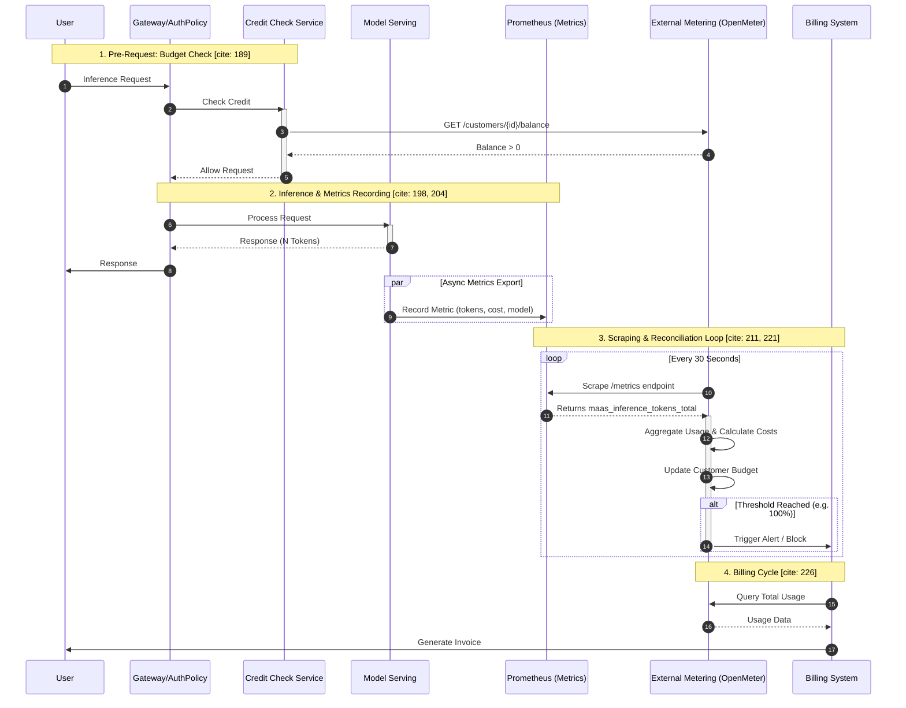

# MaaS Metering Proof of Concept
**Technical Proposal for AI Service Provider Support**

---

## Business Context

Red Hat's Model-as-a-Service (MaaS) platform currently lacks metering and quota enforcement capabilities required for AI Service Providers—customers who resell AI inference services to their own customers. This proof of concept demonstrates a **tactical solution** for credit-based access control while the MaaS product matures to support native metering and billing.

## Intent

A lightweight credit-checking service that:
- Enforces per-user inference quotas at the API gateway level
- Provides real-time allow/deny decisions for model inference requests
- Logs all credit decisions for downstream metering integration
- Maintains fast response times (<5ms) to avoid impacting inference performance

The service intercepts inference requests at the gateway, checks if the user has sufficient credits, and either allows or denies the request before it reaches the model serving layer.

**Note:** In a full production implementation this service would be a proxy for external 3rd-party metering systems like [openmeter.io](https://openmeter.io)

## Architecture Overview

Two approaches were explored. Both approaches leverage **Kuadrant AuthPolicy** with Authorino to enforce authorization at the OpenShift Gateway API level. The gateway calls a Go microservice during request processing to make credit decisions.

```
User Request → Gateway → Authorino (AuthPolicy)
                             ↓
                    Metadata Fetch: Call Go Service
                             ↓
                    OPA Authorization: Check Result
                             ↓
                    Allow/Deny Request
```

## Approach #1: Path-Aware Filtering Service

### Design
The initial approach implemented **comprehensive path filtering** within the Go service. The service received all gateway requests and classified them as:
- **Non-inference paths** (API calls, OAuth, health checks) → always allowed
- **Inference paths** (model completions) → credit check applied
- **Unknown paths** → denied (fail-closed)

### Implementation
The Go service contained ~180 lines of logic including:
- `isNonInferencePath()` - Checked for API endpoints (`/v1/models`, `/maas-api/*`, `/oauth/*`)
- `isInferencePath()` - Detected OpenAI API v1 pattern (`/{namespace}/{model}/v1/completions`)
- `evaluateRequest()` - Orchestrated the filtering and credit check logic

### Rationale
This approach was chosen because:
1. **Single enforcement point** - One gateway-level policy for all routes
2. **Flexibility** - Service had complete visibility into all requests
3. **Control** - Could make sophisticated routing decisions in Go
4. **Observability** - Centralized logging for all traffic patterns

### Challenges
- **Complexity**: Mixed routing logic with business logic (credit checking)
- **Maintenance burden**: 60+ test cases for path filtering alone
- **Performance**: String parsing and pattern matching on every request
- **Coupling**: Changes to route structure required Go code changes

### Alternative Considered
An intermediate optimization would be to keep the Go service logic but use Authorino's OPA `when` conditions to selectively call the service only for inference paths. This would reduce unnecessary service calls while maintaining the path-filtering logic in Go. However, this still couples routing decisions with business logic and was not pursued once route-level policy precedence was discovered. 

## Approach #2: Pure Credit-Checking Service (Recommended)

### Design
The simplified approach discovered that **Kuadrant route-level policies take precedence** over gateway-level policies. Therefore, all non-inference paths are handled by dedicated route-level AuthPolicies, so the gateway policy **only sees inference requests**. This eliminates the need for path filtering in the Go service.

### Implementation
The Go service is now a pure credit checker (~60 lines):
```go
func (h *CreditCheckHandler) HandleAllow(c *gin.Context) {
    username := c.GetHeader("X-Username")
    
    // Phase 1: Boolean decision (MVP)
    // Phase 2: Query actual credit balance from database/API
    allow := h.allowValue
    
    log.Printf("[CREDIT-CHECK] user=%s allow=%v", username, allow)
    c.JSON(200, AllowResponse{Allow: allow})
}
```

### Architecture
```
Request → Route Precedence
    ├─ /v1/models → maas-api-route (Route-level policy)
    ├─ /maas-api/* → maas-api-route (Route-level policy)
    ├─ /oauth/* → oauth-route (Route-level policy)
    └─ /{namespace}/{model}/v1/* → Gateway-level policy
            ↓
        Call maas-metering-2 service
            ↓
        Pure credit check (no path logic)
```

### Sequence Diagram



### Benefits
- **67% code reduction** (180 → 60 lines)
- **Single responsibility**: Only does credit checking
- **Better performance**: No path parsing overhead
- **Easier testing**: 4 test cases instead of 60+
- **Simpler maintenance**: Routing handled by Kuadrant, business logic in Go

## Evolution from #1 to #2

The transition was driven by **discovery of Kuadrant's policy precedence rules**:

1. **Initial assumption**: Gateway policy sees all requests, must filter in Go
2. **Discovery**: Route-level policies execute first and handle their routes completely
3. **Realization**: Gateway policy only processes unmatched routes (inference paths)
4. **Result**: Path filtering became unnecessary complexity

Leveraging Kuadrant's native routing achieves the same functionality with dramatically simpler code.

## External Metering Integration

This service is a **placeholder for real metering integration**. In production, the credit check would:

```go
// Phase 2: Query external metering system
credits, err := meteringClient.GetBalance(username)
if err != nil {
    return false  // Fail-closed on errors
}

// Check if user has credits
allow := credits > 0

// Record usage (async)
go meteringClient.RecordUsage(username, model, tokens)

return allow
```

Integration points for systems like **openmeter.io**:
- **Pre-request**: Query user balance → allow/deny
- **Post-request**: Report token consumption → update balance
- **Periodic**: Sync credit allocations from billing system

## Operational Considerations

### Failure Mode Strategy

A critical production decision is whether the system should **fail open** or **fail closed** when the metering service is unavailable:

**Fail Closed (Current Implementation)**
- If the Go service is down, all inference requests are denied
- **Risk**: Service outage blocks all AI inference, impacting availability
- **Benefit**: Prevents unmetered usage and billing discrepancies
- **Use case**: Strict billing requirements, high-value inference

**Fail Open (Alternative Configuration)**
- If the Go service is down, inference requests proceed without credit checks
- **Risk**: Temporary unmetered usage during outages
- **Benefit**: Maintains inference availability even during metering failures
- **Use case**: Availability-first environments, usage reconciliation acceptable

**Recommendation**: Make this behavior **business-configurable** via AuthPolicy settings or service configuration. Organizations with strict billing requirements should fail closed, while those prioritizing availability can fail open with compensating controls (alerting, post-outage reconciliation, usage limits).

Implementation approaches:
1. **AuthPolicy timeout with default deny/allow**: Configure metadata fetch timeout behavior
2. **Service health-based routing**: Route to backup "always allow" service on health check failures
3. **Circuit breaker pattern**: Automatically fail open after consecutive metering service errors

## Deployment & Testing

Both implementations are containerized and deployed to OpenShift:

**Approach #1**: `quay.io/bryonbaker/maas-metering:latest`  
**Approach #2**: `quay.io/bryonbaker/maas-metering-2:latest`

Deployment manifests use Kustomize with:
- Dedicated namespace and ServiceAccount
- ClusterIP service (cluster-internal only)
- Environment variable for credit decision (`ALLOW_VALUE=true/false`)

Testing validated:
- ✅ Non-inference paths bypass the service (approach #2 only)
- ✅ Inference paths trigger credit checks
- ✅ `ALLOW_VALUE=false` correctly denies requests
- ✅ All requests logged for audit/metering

## Recommendation

**Adopt Approach #2 (maas-metering-2)** for production use:
- Simpler architecture reduces maintenance burden
- Better performance for inference requests
- Easier to extend with real credit checking logic
- Demonstrates best practices (single responsibility, leverage platform)

---

## Code Examples

### Approach #1: Path Filtering Logic

```go
func (h *CreditCheckHandler) HandleAllow(c *gin.Context) {
    originalPath := c.GetHeader("X-Original-Path")
    username := c.GetHeader("X-Username")
    method := c.GetHeader("X-Method")

    requestType, allow := h.evaluateRequest(originalPath, method, username)
    
    log.Printf("[CREDIT-CHECK] path=%s user=%s type=%s allow=%v",
        originalPath, username, requestType, allow)
    
    c.JSON(200, AllowResponse{Allow: allow})
}

func (h *CreditCheckHandler) evaluateRequest(path, method, username string) (string, bool) {
    if isNonInferencePath(path) {
        return "non-inference", true  // Bypass credit check
    }
    
    if isInferencePath(path) {
        return "inference", h.allowValue  // Apply credit check
    }
    
    return "unknown", false  // Fail-closed
}

func isInferencePath(path string) bool {
    // Pattern: /{namespace}/{model}/v1/completions
    parts := strings.Split(strings.Trim(path, "/"), "/")
    return len(parts) >= 3 && parts[2] == "v1"
}
```

### Approach #2: Pure Credit Check

```go
func (h *CreditCheckHandler) HandleAllow(c *gin.Context) {
    username := c.GetHeader("X-Username")
    originalPath := c.GetHeader("X-Original-Path")
    
    // This handler ONLY receives inference requests
    // (Route-level policies handle everything else)
    
    // Phase 1: Simple boolean
    allow := h.allowValue
    
    // Phase 2: Real credit lookup
    // credits, err := h.meteringClient.GetBalance(username)
    // allow := credits > 0
    
    log.Printf("[CREDIT-CHECK] path=%s user=%s allow=%v",
        originalPath, username, allow)
    
    c.JSON(200, AllowResponse{Allow: allow})
}
```

### AuthPolicy Integration (Both Approaches)

```yaml
apiVersion: kuadrant.io/v1beta2
kind: AuthPolicy
metadata:
  name: gateway-auth-policy
  namespace: openshift-ingress
spec:
  targetRef:
    kind: Gateway
    name: maas-default-gateway
  
  # Step 1: Authenticate with Kubernetes TokenReview
  authentication:
    "k8s-auth":
      kubernetesTokenReview:
        audiences: ["maas"]
  
  # Step 2: Fetch credit decision from Go service
  metadata:
    credit-allow:
      http:
        url: "http://maas-metering-2.maas-metering-2.svc:8080/allow"
        method: GET
        headers:
          X-Username:
            selector: auth.identity.user.username
          X-Original-Path:
            selector: context.request.http.path
          X-Method:
            selector: context.request.http.method
  
  # Step 3: Authorize based on credit decision
  authorization:
    credit-access:
      opa:
        rego: |
          allow {
            input.auth.metadata["credit-allow"].allow == true
          }
```

---

## End-to-End Architecture with External Metering

The complete production architecture integrates the credit-checking service with external metering and billing systems:




### Future Production IMplementation




### Data Flow

**1. Pre-Request: Budget Check**
```
User Request → Credit Check Service
                     ↓
              Query Budget API (openmeter.io)
              GET /customers/{id}/balance
                     ↓
              Check: balance > 0?
                     ↓
              Return: allow=true/false
```

**2. Inference Processing**
```
If allowed → Model processes request
                     ↓
              Response generated (N tokens)
                     ↓
              Metrics recorded:
              - customer_id: "acme-corp"
              - model: "llama-3-70b"
              - tokens: 1247
              - cost: $0.0249
              - timestamp: 2026-01-08T15:23:45Z
```

**3. Metrics Scraping**
```
External System (every 30s) → Scrape Prometheus endpoint
                                      ↓
                               /metrics endpoint:
                               maas_inference_tokens_total{customer="acme-corp",model="llama-3-70b"} 1247
                               maas_inference_cost_dollars{customer="acme-corp",model="llama-3-70b"} 0.0249
```

**4. Budget Tracking**
```
Metering System → Aggregate usage
                       ↓
                  Update customer balance:
                  balance -= $0.0249
                       ↓
                  Check thresholds:
                  - 80% budget used? → Alert
                  - 100% budget used? → Soft limit warning
                  - 110% budget used? → Hard limit, block requests
```

**5. Billing Cycle**
```
End of Month → Generate invoice
                    ↓
               Total: All usage for customer
                    ↓
               Send invoice / Process payment
                    ↓
               Reset budget for next cycle
```

### Key Integration Points

**MaaS Exports (Required)**:
- Prometheus metrics endpoint with customer, model, token, and cost dimensions
- Structured logs with usage metadata (JSON format)
- Optional: OpenTelemetry traces for detailed request tracking

**External System Provides (Required)**:
- REST API for real-time budget queries: `GET /customers/{id}/balance`
- Webhook for budget alerts: `POST /webhooks/budget-alert`
- Dashboard for usage visualization and reporting

**Configuration Data (Synchronized)**:
- Customer-to-budget mappings
- Model pricing (cost per 1K tokens)
- Budget limits and alert thresholds
- Billing cycle definitions

### Example Metrics Format

```prometheus
# Prometheus metrics exposed by MaaS
maas_inference_requests_total{customer="acme-corp",model="llama-3-70b",status="success"} 847
maas_inference_requests_total{customer="acme-corp",model="llama-3-70b",status="denied"} 12
maas_inference_tokens_total{customer="acme-corp",model="llama-3-70b",type="input"} 45234
maas_inference_tokens_total{customer="acme-corp",model="llama-3-70b",type="output"} 18956
maas_inference_cost_dollars{customer="acme-corp",model="llama-3-70b"} 127.89
maas_inference_duration_seconds{customer="acme-corp",model="llama-3-70b",quantile="0.99"} 2.45
```
